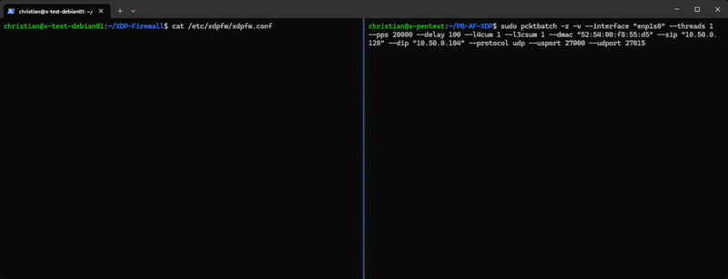
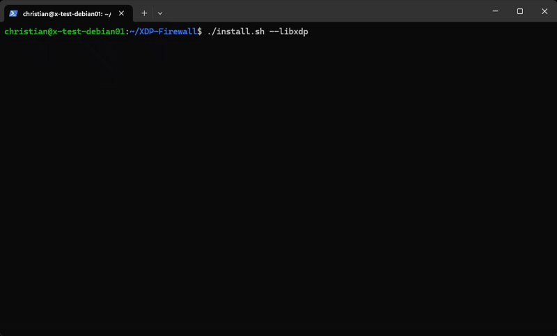
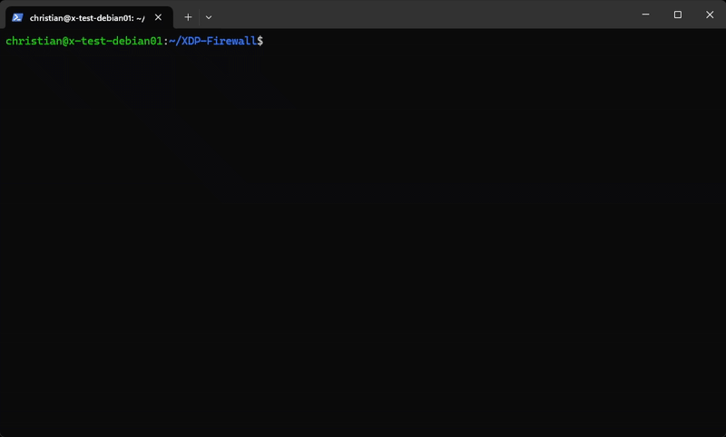

[](https://github.com/gamemann/XDP-Firewall/actions/workflows/build.yml) [](https://github.com/gamemann/XDP-Firewall/actions/workflows/run.yml)

A *stateless* firewall that attaches to the [XDP](https://www.iovisor.org/technology/xdp) hook in the Linux kernel using [(e)BPF](https://ebpf.io/) for fast packet processing.

This firewall is designed for performance and flexibility, offering features such as dynamic filtering, source IP blocking, IP range dropping, and real-time packet counters. This makes it a powerful tool for network engineers, security professionals, and anyone interested in XDP or high-performance firewalling.



I ultimately hope this tool helps existing network engineers and programmers interested in utilizing XDP or anybody interested in getting into those fields! (D)DoS protection and mitigation is an important part of Cyber Security and understanding networking concepts and packet flow at a low-to-medium level would certainly help those who are pursuing a career in the field 🙂

## 🚀 Features Overview
All features can be enabled or disabled through the build-time configuration ([`config.h`](./src/common/config.h) before compilation) or runtime configuration on disk. If you're planning to only use certain features such as the source IP block and drop functionality, it is recommended you disable other features like dynamic filtering to achieve best performance.

### 🔥 High-Performance Packet Filtering
* **XDP-Powered** - Runs at the earliest point in the network stack for **minimal latency**.
* **eBPF-Based** - Uses BPF maps for efficient rule lookups and packet processing.

### 🛑 Source IP Blocking & Dropping
* Instantly **drop packets** from known bad IP addresses.
* Uses a **BPF map** for **efficient** lookups and blocking.
* Can be managed dynamically via CLI tools (`xdpfw-add`, `xdpfw-del`).

### ⚡ Dynamic Filtering (Rule-Based)
* Define **custom rules** to allow or drop packets based on protocols, ports, IP addresses, and more!
* Supports **temporary bans** by adding IPs to the block list for a configurable duration.
* Supports **TCP, UDP, and ICMP** layer-4 protocols and **IPv6**!
* Ideal for mitigating **non-spoofed (D)DoS attacks**.

### 🌍 IP Range Dropping (CIDR)
* Block entire **IP subnets** efficiently at the XDP level.
* Supports **CIDR-based filtering** (e.g., `192.168.1.0/24`).
* Disabled by default but can be enabled in [`config.h`](./src/common/config.h).

### 📊 Real-Time Packet Counters
* Track **allowed, dropped, and passed** packets in real time.
* Supports **per-second statistics** for better traffic analysis.

### 📜 Logging System
* Built-in **logging** to terminal and/or a file.
* Configurable **verbosity levels** to control log output.

### 📌 Pinned Maps & CLI Utilities
* **Pinned BPF maps** allow external programs to interact with firewall rules.
* CLI utilities (`xdpfw-add`, `xdpfw-del`) enable **dynamic rule** management without restarting the firewall.
* Supports integration with **user-space security systems** for enhanced protection.

## 🛠️ Building & Installing
Before building, ensure the following packages are installed. These packages can be installed with `apt` on Debian-based systems (e.g. Ubuntu, etc.), but there should be similar names in other package managers.

```bash
# Install dependencies.
sudo apt install -y libconfig-dev llvm clang libelf-dev build-essential

# Install dependencies for building LibXDP and LibBPF.
sudo apt install -y libpcap-dev m4 gcc-multilib

# You may need tools for your Linux kernel since BPFTool is required.
# If this doesn't work and you still run into issues, I'd suggest building BPFTool from source (https://github.com/libbpf/bpftool).
sudo apt install -y linux-tools-$(uname -r)
```

You can use `git` to clone this project. Make sure to include the `--recursive` flag so it downloads the XDP Tools sub-module! Otherwise, you will need to execute `git submodule update --init` while in the cloned repository's directory.

```bash
# Clone repository via Git. Use recursive flag to download XDP Tools sub-module.
git clone --recursive https://github.com/gamemann/XDP-Firewall.git

# Change directory to cloned repository.
cd XDP-Firewall
```

From here, you have two options to build and install the firewall.

### With Bash Script
The easiest way to build and install the firewall is to use the provided [`install.sh`](./install.sh) Bash script. This script relies on `sudo` being installed on your system. If you do not have sudo, please refer to the below steps on building and installing this tool without the Bash script.

If you don't have LibXDP installed on your system yet, I'd recommend using the following command.

```bash
./install.sh --libxdp
```

Otherwise, you can exclude the `--libxdp` flag if you'd like.

Additionally, here is a list of flags you may pass to this script.

| Name | Description |
| ---- | ----------- |
| --libxdp | Build and install LibXDP before building the tool. |
| --no-install | Build the tool and/or LibXDP without installing them. |
| --clean | Remove build files for the tool and LibXDP. |
| --no-static | Do *not* statically link LibXDP and LibBPF object files when building the tool. This makes the build process faster, but you may need to alter your `LD_LIBRARY_PATH` env variable before running the tool and requires LibXDP to be installed on your system already. |
| --objdump | Dumps the XDP/BPF object file using [`llvm-objdump`](https://llvm.org/docs/CommandGuide/llvm-objdump.html) to Assemby into `objdump.asm`. This is used for debugging. |
| --help | Displays help message. |



### Without Bash Script
If you do not want to use the Bash script above, you may use `make` to build and install this tool instead.

```
# Build XDP-Tools (LibXDP and LibBPF).
make libxdp

# Install LibXDP & LibBPF onto your system.
# Warning: This command must be executed as root! `sudo` should do this for you if you have it installed and have privileges.
sudo libxdp_install

# Build the firewall tool.
make

# Install the tool onto your system.
# Warning: This command must be executed as root! `sudo` should do this for you if you have it installed and have privileges.
sudo make install
```



## 💻 CLI Usage
The following command line arguments are supported when running the firewall.

| Name | Default | Description |
| ---- | ------- | ----------- |
| -c, --config | `/etc/xdpfw/xdpfw.conf` | The path to the config file. |
| -o, --offload | N/A | If set, attempts to load the XDP program in hardware/offload mode. |
| -s, --skb | N/A | If set, forces the XDP program to be loaded using SKB mode instead of DRV mode. |
| -t, --time | N/A | If set, will run the tool for this long in seconds. E.g. `--time 30` runs the tool for 30 seconds before exiting. |
| -l, --list | N/A | If set, will print the current config values and exit. |
| -h, --help | N/A | Prints a help message. |

Additionally, there are command line overrides for base config options you may include.

| Name | Example | Description |
| ---- | ------- | ----------- |
| -v, --verbose | `-v 3` | Overrides the config's verbose value. |
| --log-file | `--log-file ./test.log` | Overrides the config's log file value. |
| -i, --interface | `-i enp1s0` | Overrides the config's first interface value. |
| -p, --pin-maps | `-p 0` | Overrides the config's pin maps value. |
| -u, --update-time | `-u 30` | Overrides the config's update time value. |
| -n, --no-stats | `-n 1` | Overrides the config's no stats value. |
| --stats-ps | `--stats-ps 1` | Overrides the config's stats per second value. |
| --stdout-ut | `--stdout-ut 500` | Overrides the config's stdout update time value. |

## ⚙️ Configuration
There are two configuration methods for this firewall:

1️⃣ **Build-Time Configuration** - Modify hard-coded constants in [`config.h`](./src/common/config.h) by commenting (`//`) or uncommenting options along with setting values. Since these settings are required at build time, the firewall must be rebuilt for changes to take effect.

2️⃣ **Runtime Configuration** - Settings can also be adjusted via a configuration file stored on disk. By default, this file is located at `/etc/xdpfw/xdpfw.conf`, but you can specify a different path using the `-c` or `--config` CLI options.

The [`libconfig`](https://hyperrealm.github.io/libconfig/libconfig_manual.html) library and syntax is used when parsing the config file.

Here are more details on the layout of the runtime configuration.

### Main
| Name | Type | Default | Description |
| ---- | ---- | ------- | ----------- |
| verbose | int | `2` | The verbose level for logging (0 - 5 supported so far). |
| log_file | string | `/var/log/xdpfw.log` | The log file location. If the string is empty (`""`), the log file is disabled. |
| interface | string \| list of strings | `NULL` | The network interface(s) to attach the XDP program to (usually retrieved with `ip a` or `ifconfig`). |
| pin_maps | bool | `true` | Pins main BPF maps to `/sys/fs/bpf/xdpfw/[map_name]` on the file system. |
| update_time | int | `0` | How often to update the config and filtering rules from the file system in seconds (0 disables). |
| no_stats | bool | `false` | Whether to enable or disable packet counters. Disabling packet counters will improve performance, but result in less visibility on what the XDP Firewall is doing. |
| stats_per_second | bool | `false` | If true, packet counters and stats are calculated per second. `stdout_update_time` must be 1000 or less for this to work properly. |
| stdout_update_time | int | `1000` | How often to update `stdout` when displaying packet counters in milliseconds. |
| filters | list of filter objects | `()` | A list of filters to use with the XDP Firewall. |
| ip_drop_ranges | list of strings | `()` | A list of IP ranges (strings) to drop if the IP range drop feature is enabled. | 

### Filter Object
| Name | Type | Default | Description |
| ---- | ---- | ------- | ----------- |
| enabled | bool | `true` | Whether the rule is enabled or not. |
| log | bool | `false` | Whether to log packets that are matched. |
| action | int | `1` | The value of `0` drops or blocks the packet while `1` allows/passes the packet through. |
| block_time | int | `1` | The amount of seconds to block the source IP for if matched. |
| pps | int64 | `NULL` | Matches if this threshold of packets per second is exceeded for a source IP. |
| bps | int64 | `NULL` | Matches if this threshold of bytes per second is exceeded for a source IP. |

#### IP Options
| Name | Type | Default | Description |
| ---- | ---- | ------- | ----------- |
| src_ip | string | `NULL` | The source IPv4 address to match (e.g. `10.50.0.3`). CIDRs are also supported (e.g. `10.50.0.0/24`)! |
| dst_ip | string | `NULL` | The destination IPv4 address to match (e.g. `10.50.0.4`). CIDRs are also supported (e.g. `10.50.0.0/24`)! |
| src_ip6 | string | `NULL` | The source IPv6 address to match (e.g. `fe80::18c4:dfff:fe70:d8a6`). |
| dst_ip6 | string | `NULL` | The destination IPv6 address to match (e.g. `fe80::ac21:14ff:fe4b:3a6d`). |
| min_ttl | int | `NULL` | The minimum TTL (time-to-live) to match. |
| max_ttl | int | `NULL` | The maximum TTL (time-to-live) to match. |
| max_len | int | `NULL` | The maximum packet length to match (includes the entire packet including the ethernet header and payload). |
| tos | int | `NULL` | The ToS (type-of-service) to match. |

#### TCP Options
You may additionally specified TCP header options for a filter rule which start with `tcp_`.

| Name | Type | Default | Description |
| ---- | ---- | ------- | ----------- |
| tcp_enabled | bool | `false` | Whether to enable TCP on this filter rule. |
| tcp_sport | int \| string | `NULL` | The TCP source port to match with single range support (e.g., `"20-22"`). |
| tcp_dport | int \| string | `NULL` | The TCP destination port to match with single range support (e.g., `"20-22"`). |
| tcp_syn | bool | `false` | Matches if the TCP SYN flag is set. |
| tcp_ack | bool | `false` | Matches if the TCP ACK flag is set. |
| tcp_rst | bool | `false` | Matches if the TCP RST flag is set. |
| tcp_psh | bool | `false` | Matches if the TCP PSH flag is set. |
| tcp_urg | bool | `false` | Matches if the TCP URG flag is set. |
| tcp_fin | bool | `false` | Matches if the TCP FIN flag is set. |
| tcp_ece | bool | `false` | Matches if the TCP ECE flag is set. |
| tcp_cwr | bool | `false` | Matches if the TCP CWR flag is set. |

#### UDP Options
You may additionally specified UDP header options for a filter rule which start with `udp_`.

| Name | Type | Default | Description |
| ---- | ---- | ------- | ----------- |
| udp_enabled | bool | `false` | Whether to enable UDP on this filter rule. |
| udp_sport | int | `NULL` | The UDP source port to match with single range support (e.g., `"27000-27015"`). |
| udp_dport | int | `NULL` | The UDP destination port to match with single range support (e.g., `"27000-27015"`). |

#### ICMP Options
You may additionally specified UDP header options for a filter rule which start with `icmp_`.

| Name | Type | Default | Description |
| ---- | ---- | ------- | ----------- |
| icmp_enabled | bool | `false` | Whether to enable ICMP on this filter rule. |
| icmp_code | int | `NULL` | The ICMP code to match. |
| icmp_type | int | `NULL` | The ICMP type to match. |

#### Notes
* When a setting field inside of a filter rule is not set or if it's set to `-1` (or `NULL`), the default setting value will be used (see [`set_filter_defaults()`](https://github.com/gamemann/XDP-Firewall/blob/master/src/loader/utils/config.c#L1047)).
* When a filter rule's setting is set, but doesn't match the packet, the program moves onto the next filter rule. Therefore, all of the filter rule's settings that are set must match the packet in order to perform the action specified. Think of it as something like `if src_ip == "10.50.0.3" and udp_dport == 27015: action`. 
* As of right now, you can specify up to **60 total** dynamic filter rules. You may increase this limit by raising the `MAX_FILTERS` constant in the `src/common/config.h` [file](https://github.com/gamemann/XDP-Firewall/blob/master/src/common/config.h#L5) and then recompile the firewall. If you receive a BPF program too large error, this is due to BPF's limitations with complexity and jumps. You may try increasing BPF limitations manually or with a patch. If you want to do this, please read [this](https://github.com/gamemann/XDP-Proxy/tree/master/patches) from my XDP Proxy project.
* At this time, each port value supports a single port range per filter rule. This is because adding support for multiple ports/port ranges would require an additional `for` loop which would make the BPF program larger and result in slower performance, etc.

### Runtime Example
Here's a runtime config example.

```squidconf
verbose = 5;
log_file = "";
interface = "ens18";
pin_maps = true;
update_time = 15;
no_stats = false;
stats_per_second = true;

filters = (
    {
        enabled = true,
        action = 0,

        udp_enabled = true,
        udp_dport = 27015
    },
    {
        enabled = true,
        action = 1,

        tcp_enabled = true,
        tcp_syn = true,
        tcp_dport = 27015
    },
    {
        enabled = true,
        action = 0,

        icmp_enabled = true,
        icmp_code = 0
    },
    {
        enabled = true,
        action = 0,
        src_ip = "10.50.0.4"
    }
);

ip_drop_ranges = ( "192.168.1.0/24", "10.3.0.0/24" );
```

## 🔧 The `xdpfw-add` & `xdpfw-del` Utilities
When the main BPF maps are pinned to the file system (depending on the `pin_maps` runtime option detailed above), this allows you to add or delete rules while the firewall is running using the `xdpfw-add` and `xdpfw-del` utilities.

### General CLI Usage
The following general CLI arguments are supported with these utilities.

| Name | Example | Description |
| ---- | ------- | ----------- |
| -c, --cfg | `-c ./local/conf` | The path to the configuration file (required if the save argument is specified or if you're using dynamic filters mode). |
| -s, --save | `-s` | Updates the runtime config file. |
| -m, --mode | `-m 1` | The mode to use (0 = dynamic filters, 1 = IP range drop list, 2 = source IP block list). |
| -i, --idx | `-i 3` | The index to update or delete when running in filters mode. |
| -d, --ip | `-d 192.168.1.0/24` | The IP range or source IP when running in IP range drop list or source IP block list modes. |
| -v, --v6 | `-v` | Parses and adds the IP address as IPv6 when running in source IP block list mode. |

### The `xdpfw-add` Tool
This CLI tool allows you to add dynamic rules, IP ranges to the drop list, and source IPs to the block list. I'd recommend using `xdpfw-add -h` for more information.

#### Additional CLI Usage
The following CLI arguments are supported.

| Name | Example | Description |
| ---- | ------- | ----------- |
| -e, --expires | `-e 60` | When the source IP block expires in seconds when running in IP block list mode. |
| --enabled | `--enabled 0` | Enables or disables dynamic filter. |
| --action | `--action 1` | The action to perform on packets that match the filter (0 = drop, 1 = allow). |
| --log | `--log 1` | Enables or disables logging for the dynamic filter. |
| --block-time | `--block-time 60` | How long to block the source IP for if the packet is matched and the action is drop in the dynamic filter (0 = no time). | 
| --sip | `--sip 192.168.1.0/24` | The source IPv4 address/range to match with the dynamic filter. |
| --dip | `--sip 10.90.0.0/24` | The destination IPv4 address/range to match with the dynamic filter. |
| --sip6 | `--sip 192.168.1.0/24` | The source IPv6 address to match with the dynamic filter. |
| --dip6 | `--sip 192.168.1.0/24` | The destination IPv6 address to match with the dynamic filter. |
| --min-ttl | `--min-ttl 0` | The IP's minimum TTL to match with the dynamic filter. |
| --max-ttl | `--max-ttl 6` | The IP's maximum TTL to match with the dynamic filter. |
| --min-len | `--min-len 42` | The packet's mimimum length to match with the dynamic filter. |
| --max-len | `--max-len 96` | The packet's maximum length to match with the dynamic filter. |
| --tos | `--tos 1` | The IP's Type of Service to match with the dynamic filter. |
| --pps | `--pps 10000` | The minimum PPS rate to match with the dynamic filter. |
| --bps | `--bps 126000` | The minimum BPS rate to match with the dynamic filter. |
| --tcp | `--tcp 1` | Enables or disables TCP matching with the dynamic filter. |
| --tsport | `--tsport 22` | The TCP source port to match with the dynamic filter. |
| --tdport | `--tdport 443` | The TCP destination port to match with the dynamic filter. |
| --urg | `--urg 1` | Enables or disables TCP URG flag matching with the dynamic filter. |
| --ack | `--ack 1` | Enables or disables TCP ACK flag matching with the dynamic filter. |
| --rst | `--rst 1` | Enables or disables TCP RST flag matching with the dynamic filter. |
| --psh | `--psh 1` | Enables or disables TCP PSH flag matching with the dynamic filter. |
| --syn | `--syn 1` | Enables or disables TCP SYN flag matching with the dynamic filter. |
| --fin | `--fin 1` | Enables or disables TCP FIN flag matching with the dynamic filter. |
| --ece | `--ece 1` | Enables or disables TCP ECE flag matching with the dynamic filter. |
| --cwr | `--cwr 1` | Enables or disables TCP CWR flag matching with the dynamic filter. |
| --udp | `--udp 1` | Enables or disables UDP matching with the dynamic filter. |
| --usport | `--usport 53` | The UDP source port to match with the dynamic filter. |
| --udport | `--udport 27015` | The UDP destination port to match with the dynamic filter. |
| --icmp | `--icmp 1` | Enables or disables ICMP matching with the dynamic filter. |
| --code | `--code 1` | The ICMP code to match with the dynamic filter. |
| --type | `--type 8` | The ICMP type to match with the dynamic filter. |

### The `xdpfw-del` Tool
This CLI tool allows you to delete dynamic rules, IP ranges from the drop list, and source IPs from the block list.

There is no additional CLI usage for this tool. Please refer to the general CLI usage above.

## 📝 Notes
### XDP Attach Modes
By default, the firewall attaches to the Linux kernel's XDP hook using **DRV** mode (AKA native; occurs before [SKB creation](http://vger.kernel.org/~davem/skb.html)). If the host's network configuration or network interface card (NIC) doesn't support DRV mode, the program will attempt to attach to the XDP hook using **SKB** mode (AKA generic; occurs after SKB creation which is where IPTables and NFTables are processed via the `netfilter` kernel module). You may use overrides through the command-line to force SKB or offload modes.

Reasons for a host's network configuration not supporting XDP's DRV mode may be the following.

* Running an outdated kernel that doesn't support your NIC's driver.
* Your NIC's driver not yet being supported. [Here's](https://github.com/iovisor/bcc/blob/master/docs/kernel-versions.md#xdp) a NIC driver XDP support list. With enough Linux kernel development knowledge, you could try implementing XDP DRV support into your non-supported NIC's driver (I'd highly recommend giving [this](https://www.youtube.com/watch?v=ayFWnFj5fY8) video a watch!).
* You don't have enough RX/TX queues (e.g. not enabling multi-queue) or your RX/TX queue counts aren't matching. From the information I gathered, it's recommended to have one RX and TX queue per CPU core/thread. You could try learning how to use [ethtool](https://man7.org/linux/man-pages/man8/ethtool.8.html) and try altering the NIC's RX/TX queue settings ([this](https://www.linode.com/docs/guides/multiqueue-nic/) article may be helpful!).

#### Offload Information
Offloading your XDP/BPF program to your system's NIC allows for the fastest packet processing you can achieve due to the NIC dropping the packets with its hardware. However, for one, there are **not** many NIC manufacturers that do support this feature **and** you're limited to the NIC's memory/processing (e.g. your BPF map sizes will be extremely limited). Additionally, there are usually stricter BPF verifier limitations for offloaded BPF programs, but you may try reaching out to the NIC's manufacturer to see if they will give you a special version of their NIC driver raising these limitations (this is what I did with one manufacturer I used).

As of this time, I am not aware of any NIC manufacturers that will be able to offload this firewall completely to the NIC due to its BPF complexity. To be honest, in the current networking age, I believe it's best to leave offloaded programs to BPF map lookups and minimum packet inspection. For example, a BPF blacklist map lookup for malicious source IPs or ports. However, XDP is still very new and I would imagine we're going to see these limitations loosened or lifted in the next upcoming years. This is why I added support for offload mode on this firewall. 

### BPF Loop Support + Performance Notes
The dynamic filters feature requires loop support with BPF. Older kernels will not support this feature and output an error such as the following.

```vim
libbpf: load bpf program failed: Invalid argument
libbpf: -- BEGIN DUMP LOG ---
libbpf:
back-edge from insn 113 to 100

libbpf: -- END LOG --
libbpf: failed to load program 'xdp_prog'
libbpf: failed to load object '/etc/xdpfw/xdpfw_kern.o'
```

It looks like BPF loop [support](https://lwn.net/Articles/794934/) was added in kernel 5.3. Therefore, you'll need kernel 5.3 or above for this program to run properly.

#### Performance With Loops & Dynamic Filters
Due to the usage of a [`for` loop](https://github.com/gamemann/XDP-Firewall/blob/master/src/xdp/prog.c#L249) inside the XDP program that handles looping through all filtering rules inside of a BPF array map, performance will be impacted depending on how many filtering rules you have configured (ultimately, the firewall **doesn't scale** that well). This firewall was designed to be as flexible as possible regarding configuration and is most effective when configured to add malicious source IPs to the block map for a certain amount of time which are then dropped at the beginning of the XDP program for the best performance.

Unfortunately, we can't really eliminate the `for` loop with the current amount of flexibility we allow (especially minimum/maximum TTL, packet lengths, IDs, etc.), unless if we were to create more BPF maps and insert many more entries which would result in a lot more memory consumed and isn't ideal at all. If we were to remove flexibility, the best approach would be to store filtering rules inside a hashed BPF map using the packet's destination IP/port as the entry's key in my opinion (this would then eliminate flexibility related to being able to specify a filtering rule to match against a single destination IP without a port, unless if we implemented multiple BPF map lookups inside the XDP program which would then impact performance). However, there are currently no plans to switch to this format due to the amount of flexibility lost and also not having the time on my side (if somebody else creates a PR to implement this, I'd be willing to have a separate branch with the new functionality for others to use if the current branch isn't working out for their needs).

The firewall is still decent at filtering non-spoofed attacks, especially when a block time is specified so that malicious IPs are filtered at the beginning of the program for some time.

### Rate Limits
By default, client stats including packets and bytes per second are calculated per *partial* flow (source IP/port and protocol). This is useful if you want to specify connection-specific rate limits inside of your filtering rules using the `pps` and `bps` settings. However, if you want to calculate client stats using only the source IP, you may comment out [this](https://github.com/gamemann/XDP-Firewall/blob/master/src/common/config.h#L12) line.

```C
//#define USE_FLOW_RL
```

### Filter Logging
This tool uses `bpf_ringbuf_reserve()` and `bpf_ringbuf_submit()` for filter match logging. At this time, there is no rate limit for the amount of log messages that may be sent. Therefore, if you're encountering a spoofed attack that is matching a filter rule with logging enabled, it will cause additional processing and disk load.

I recommend only enabling filter logging at this time for debugging. If you'd like to disable filter logging entirely (which will improve performance slightly), you may comment out the `ENABLE_FILTER_LOGGING` line [here](https://github.com/gamemann/XDP-Firewall/blob/master/src/common/config.h#L27).

```C
//#define ENABLE_FILTER_LOGGING
```

I will most likely implement functionality to rate limit log messages from XDP in the future.

### LibBPF Logging
When loading the BPF/XDP program through LibXDP/LibBPF, logging is disabled unless if the `verbose` log setting is set to `5` or higher.

If the tool fails to load or attach the XDP program, it is recommended you set `verbose` to 5 or above so LibXDP outputs specific warnings and errors.

## ❓ F.A.Q.
### I receive an error related to failing to load shared libraries. How do I fix this?
If you receive an error similar to the one below when running the program and have built the program using the no static option, make sure you have LibXDP globally installed onto your system via [XDP Tools](https://github.com/xdp-project/xdp-tools). You can execute `make libxdp && sudo make libxdp_install` to build and install both LibXDP and LibBPF onto your system separately.

```bash
./xdpfw: error while loading shared libraries: libxdp.so.1: cannot open shared object file: No such file or directory
```

If you still run into issues, try adding `/usr/local/lib` to your `LD_LIBRARY_PATH` since that's where LibXDP installs the shared objects from my testing. Here's an example.

```bash
export LD_LIBRARY_PATH=/usr/local/lib

sudo xdpfw
```

### I receive an error related to toolchain hardening. How do I fix this?
As stated in issue [#38](https://github.com/gamemann/XDP-Firewall/issues/38) by [g00g1](https://github.com/g00g1), if you have toolchain hardening enabled, you may receive the following error when compiling.

```
error: <unknown>:0:0: in function xdp_prog_main i32 (ptr): A call to built-in function '__stack_chk_fail' is not supported.
```

In order to fix this, you'll need to pass the `-fno-stack-protector` flag to Clang when building LibBPF and the firewall itself. You'll want to modify the `Makefile` for each project to add this flag. Patches for this may be found [here](https://github.com/gamemann/XDP-Firewall/issues/38#issuecomment-1547965524)!

### I have issues running the firewall on Ubuntu 20.04. What could be the cause?
If you have issues on Ubuntu 20.04 or earlier, please refer to the reply on [this](https://github.com/gamemann/XDP-Firewall/issues/41#issuecomment-1758701008) issue.

Basically, Clang/LLVM 12 or above is required and I'd recommend running Linux kernel 5.3 or above.

### Will you make this firewall stateful?
At this time, there are no plans to make this firewall stateful. There is a chance I may make a separate firewall with basic connection tracking, but I have no ETA on that and haven't started its development. With that said, I cannot share code for things like layer-7 filters or a full TCP proxy with SYN cookies support.

## 🌟 My Other XDP Projects
I just wanted to share other open source projects I've made which also utilize XDP (or AF_XDP sockets) for those interested. I hope code from these other projects help programmers trying to utilize XDP in their own projects!

### [XDP Proxy](https://github.com/gamemann/XDP-Proxy)
A *stateless*, high-performance NAT-like proxy that attaches to the [XDP](https://www.iovisor.org/technology/xdp) hook in the Linux kernel using [(e)BPF](https://ebpf.io/) for fast packet processing.

This proxy forwards packets based on configurable rules and performs **source-port mapping**, similar to [IPTables](https://linux.die.net/man/8/iptables) and [NFTables](https://wiki.nftables.org/wiki-nftables/index.php/Main_Page).

### [Kilimanjaro](https://github.com/gamemann/Kilimanjaro)
This is a complex packet processing/forwarding/dropping project I made for a gaming community I was a part of that utilizes XDP, AF_XDP, and the IPIP network protocol. I no longer work on/maintain the project, but the source code may be very helpful to other XDP developers, especially when it comes to manipulating packets inside of XDP and such.

### [Packet Batch (AF_XDP)](https://github.com/Packet-Batch/PB-AF-XDP)
An application that utilizes fast [AF_XDP](https://docs.kernel.org/networking/af_xdp.html) Linux sockets to generate and send network packets. This is used for penetration testing including [Denial of Service](https://www.cloudflare.com/learning/ddos/glossary/denial-of-service/) (DoS), network monitoring, and more!

While this application doesn't utilize native XDP or (e)BPF, I do feel it should be mentioned here. AF_XDP sockets are very fast and often used with raw XDP programs via the `bpf_redirect_map()` function call (also see my [XDP Stats](https://github.com/gamemann/XDP-Stats) project which calculates stats in raw XDP and AF_XDP programs).

## 🙌 Credits
* [Christian Deacon](https://github.com/gamemann) - Creator.
* [Phil](https://github.com/Nasty07) - Contributor.
