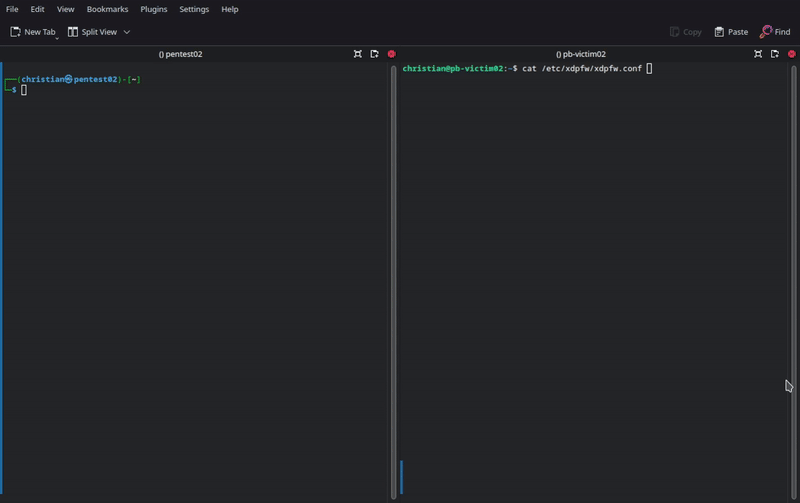

[](https://github.com/gamemann/XDP-Firewall/actions/workflows/build.yml) [](https://github.com/gamemann/XDP-Firewall/actions/workflows/run.yml)

A *stateless* firewall that attaches to the Linux kernel's [XDP](https://www.iovisor.org/technology/xdp) hook through [(e)BPF](https://ebpf.io/) for fast packet processing. This firewall is designed to read filtering rules based off of a config file on disk and filter incoming packets. Both IPv4 and **IPv6** are supported! The protocols currently supported are TCP, UDP, and ICMP. With that said, the program comes with accepted and dropped/blocked packet statistics which may be disabled if need to be.

Additionally, if the host's network configuration or network interface card (NIC) doesn't support the XDP DRV hook (AKA native; occurs before [SKB creation](http://vger.kernel.org/~davem/skb.html)), the program will attempt to attach to the XDP SKB hook (AKA generic; occurs after SKB creation which is where IPTables and NFTables are processed via the `netfilter` kernel module). You may use overrides through the command-line to force SKB or offload modes.

With that said, reasons for a host's network configuration not supporting XDP's DRV hook may be the following.

* Running an outdated kernel that doesn't support your NIC's driver.
* Your NIC's driver not yet being supported. [Here's](https://github.com/iovisor/bcc/blob/master/docs/kernel-versions.md#xdp) a NIC driver XDP support list. With enough Linux kernel development knowledge, you could try implementing XDP DRV support into your non-supported NIC's driver (I'd highly recommend giving [this](https://www.youtube.com/watch?v=ayFWnFj5fY8) video a watch!).
* You don't have enough RX/TX queues (e.g. not enabling multi-queue) or your RX/TX queue counts aren't matching. From the information I gathered, it's recommended to have one RX and TX queue per CPU core/thread. You could try learning how to use [ethtool](https://man7.org/linux/man-pages/man8/ethtool.8.html) and try altering the NIC's RX/TX queue settings ([this](https://www.linode.com/docs/guides/multiqueue-nic/) article may be helpful!).

I hope this project helps existing network engineers/programmers interested in utilizing XDP or anybody interested in getting into those fields! (D)DoS mitigation/prevention is such an important part of Cyber Security and understanding the concept of networking and packet flow on a low-medium level would certainly help those who are pursuing a career in the field 🙂



## Command Line Usage
The following command line arguments are supported:

* `--config -c` => Location to config file. Default => **/etc/xdpfw/xdpfw.conf**.
* `--offload -o` => Tries to load the XDP program in hardware/offload mode (please read **Offload Information** below).
* `--skb -s` => Forces the program to load in SKB mode instead of DRV.
* `--time -t` => How long to run the program for in seconds before exiting. 0 or not set = infinite.
* `--list -l` => List all filtering rules scanned from config file.
* `--help -h` => Print help menu for command line options.

### Offload Information
Offloading your XDP/BPF program to your system's NIC allows for the fastest packet processing you can achieve due to the NIC dropping the packets with its hardware. However, for one, there are **not** many NIC manufacturers that do support this feature **and** you're limited to the NIC's memory/processing (e.g. your BPF map sizes will be extremely limited). Additionally, there are usually stricter BPF verifier limitations for offloaded BPF programs, but you may try reaching out to the NIC's manufacturer to see if they will give you a special version of their NIC driver raising these limitations (this is what I did with one manufacturer I used).

As of this time, I am not aware of any NIC manufacturers that will be able to offload this firewall completely to the NIC due to its BPF complexity. To be honest, in the current networking age, I believe it's best to leave offloaded programs to BPF map lookups and minimum packet inspection. For example, a BPF blacklist map lookup for malicious source IPs or ports. However, XDP is still very new and I would imagine we're going to see these limitations loosened or lifted in the next upcoming years. This is why I added support for offload mode on this firewall. 

## Configuration File Options
### Main
* `interface` => The interface for the XDP program to attach to.
* `update_time` => How often to update the config and filtering rules. Leaving this at 0 disables auto-updating.
* `no_stats` => If true, no accepted/blocked packet statistics will be displayed in `stdout`.
* `stdout_update_time` => The amount of time in milliseconds to update `stdout` with counters. Default is set to `1000` (one second).

### Filters
Config option `filters` is an array. Each filter includes the following options:

* `enabled` => If true, this rule is enabled.
* `action` => What action to perform against the packet if matched. 0 = Block. 1 = Allow.
* `src_ip` => The source IP address the packet must match (e.g. 10.50.0.3).
* `dst_ip` => The destination IP address the packet must match (e.g. 10.50.0.4).
* `src_ip6` => The source IPv6 address the packet must match (e.g. fe80::18c4:dfff:fe70:d8a6).
* `dst_ip6` => The destination IPv6 address the packet must match (e.g. fe80::ac21:14ff:fe4b:3a6d).
* `min_ttl` => The minimum TTL (time to live) the packet must match.
* `max_ttl` => The maximum TTL (time to live) the packet must match.
* `max_len` => The maximum packet length the packet must match. This includes the entire frame (ethernet header, IP header, L4 header, and data).
* `min_len` => The minimum packet length the packet must match. This includes the entire frame (ethernet header, IP header, L4 header, and data).
* `tos` => The TOS (type of service) the packet must match.
* `pps` => The maximum packets per second a source IP can send before matching.
* `bps` => The maximum amount of bytes per second a source IP can send before matching.
* `block_time` => The time in seconds to block the source IP if the rule matches and the action is block (0). Default value is `1`.

#### TCP Options
TCP options exist in the main filter array and start with `tcp_`. Please see below.

* `tcp_enabled` => If true, check for TCP-specific matches.
* `tcp_sport` => The source port the packet must match.
* `tcp_dport` => The destination port the packet must match.
* `tcp_urg` => If true, the packet must have the `URG` flag set to match.
* `tcp_ack` => If true, the packet must have the `ACK` flag set to match.
* `tcp_rst` => If true, the packet must have the `RST` flag set to match.
* `tcp_psh` => If true, the packet must have the `PSH` flag set to match.
* `tcp_syn` => If true, the packet must have the `SYN` flag set to match.
* `tcp_fin` => If true, the packet must have the `FIN` flag set to match.
* `tcp_ece` => If true, the packet must have the `ECE` flag set to match.
* `tcp_cwr` => If true, the packet must have the `CWR` flag set to match.

#### UDP Options
UDP options exist in the main filter array and start with `udp_`. Please see below.

* `udp_enabled` => If true, check for UDP-specific matches.
* `udp_sport` => The source port the packet must match.
* `udp_dport` => The destination port the packet must match.

#### ICMP Options
ICMP options exist in the main filter array and start with `icmp_`. Please see below.

* `icmp_enabled` => If true, check for ICMP-specific matches.
* `icmp_code` => The ICMP code the packet must match.
* `icmp_type` => The ICMP type the packet must match.

Everything besides the main `enabled` and `action` options within a filter are **not** required. This means you do not have to define them within your config.

**Note** - As of right now, you can specify up to 80 maximum filters. This is due to BPF's limitations with complexity and jumps. If you want more than 80 filters, you may increase BPF limitations manually or with a patch. If you want to do this, please read [this](https://github.com/gamemann/XDP-Forwarding/tree/master/patches) README from my XDP Forwarding project. Afterwards, feel free to raise the `MAX_FILTERS` constant in the `src/xdpfw.h` [file](https://github.com/gamemann/XDP-Firewall/blob/master/src/xdpfw.h#L6) and then recompile the firewall.

## Configuration Example
Here's an example of a config:

```squidconf
interface = "ens18";
update_time = 15;

filters = (
    {
        enabled = true,
        action = 0,

        udp_enabled = true,
        udp_dport = 27015
    },
    {
        enabled = true,
        action = 1,

        tcp_enabled = true,
        tcp_syn = true,
        tcp_dport = 27015
    },
    {
        enabled = true,
        action = 0,

        icmp_enabled = true,
        icmp_code = 0
    },
    {
        enabled = true,
        action = 0,
        src_ip = "10.50.0.4"
    }
);
```

## Building & Installation
Before building, ensure the following packages are installed. These packages are installed via `apt` (Ubuntu, Debian, etc.), but there should be similar package names in other package managers.

```bash
# Install dependencies.
sudo apt install -y libconfig-dev llvm clang libelf-dev build-essential

# Install dependencies for building LibXDP and LibBPF.
sudo apt install -y libpcap-dev m4 gcc-multilib

# You need tools for your kernel since we need BPFTool. If this doesn't work, I'd suggest building BPFTool from source (https://github.com/libbpf/bpftool).
sudo apt install -y linux-tools-$(uname -r)
```

You can use `git` and `make` to build this project. The following should work:

```bash
# Clone repository via Git. Use recursive flag to download LibBPF sub-module.
git clone --recursive https://github.com/gamemann/XDP-Firewall.git

# Change directory to repository.
cd XDP-Firewall

# Build XDP-Tools and install LibXDP & LibBPF to /usr/include.
# Warning - This command uses Sudo for root access! 
# Feel free to remove sudo from the Makefile and execute as root otherwise.
make libxdp

# Build main project and install as root via Sudo.
make && sudo make install
```

## Notes
### Move To LibXDP
On **June 6th, 2023**, support for [LibXDP](https://github.com/xdp-project/xdp-tools/tree/master/lib/libxdp) from [XDP Tools](https://github.com/xdp-project/xdp-tools) was added. This requires additional packages and tools to install and use with this XDP firewall as noted above.

If you're having issues with LibXDP, you may go back to commit [b54c466](https://github.com/gamemann/XDP-Firewall/tree/b54c46638d32306ec27aecc69a830283aef17e61) to use an older version of LibBPF that has worked for years for this XDP firewall.

```bash
# Make sure we're in the repository's directory.
cd XDP-Firewall

# Checkout old commit.
git checkout b54c466

# Build and install using old commit & LibBPF.
make && sudo make install
```

### Issues On Ubuntu 20.04
If you have issues on Ubuntu 20.04 or earlier, please refer to the reply on [this](https://github.com/gamemann/XDP-Firewall/issues/41#issuecomment-1758701008) issue.

Basically, Clang/LLVM 12 or above is required and I'd recommend running Linux kernel 5.15 or above.

### BPF For/While Loop Support + Performance Notes
This project requires for/while loop support with BPF. Older kernels will not support this and output an error such as:

```vim
libbpf: load bpf program failed: Invalid argument
libbpf: -- BEGIN DUMP LOG ---
libbpf:
back-edge from insn 113 to 100

libbpf: -- END LOG --
libbpf: failed to load program 'xdp_prog'
libbpf: failed to load object '/etc/xdpfw/xdpfw_kern.o'
```

It looks like BPF while/for loop [support](https://lwn.net/Articles/794934/) was added in kernel 5.3. Therefore, you'll need kernel 5.3 or above for this program to run properly.

#### Performance With `For` Loops
Due to the usage of a [`for` loop](https://github.com/gamemann/XDP-Firewall/blob/master/src/xdpfw_kern.c#L330) inside the XDP program that handles looping through all filtering rules inside of a BPF array map, performance will be impacted depending on how many filtering rules you have configured (ultimately, the firewall **doesn't scale** that well). This firewall was designed to be as flexible as possible regarding configuration and is most effective when configured to add malicious source IPs to the block map for a certain amount of time which are then dropped at the beginning of the XDP program for the best performance.

Unfortunately, we can't really eliminate the `for` loop with the current amount of flexibility we allow (especially minimum/maximum TTL, packet lengths, IDs, etc.), unless if we were to create more BPF maps and insert many more entries which would result in a lot more memory consumed and isn't ideal at all. If we were to remove flexibility, the best approach would be to store filtering rules inside a hashed BPF map using the packet's destination IP/port as the entry's key in my opinion (this would then eliminate flexibility related to being able to specify a filtering rule to match against a single destination IP without a port, unless if we implemented multiple BPF map lookups inside the XDP program which would then impact performance). However, there are currently no plans to switch to this format due to the amount of flexibility lost and also not having the time on my side (if somebody else creates a PR to implement this, I'd be willing to have a separate branch with the new functionality for others to use if the current branch isn't working out for their needs).

The firewall is still decent at filtering non-spoofed attacks, especially when a block time is specified so that malicious IPs are filtered at the beginning of the program for some time.

### Error Related To Toolchain Hardening
As stated in issue [#38](https://github.com/gamemann/XDP-Firewall/issues/38) by [g00g1](https://github.com/g00g1), if you have toolchain hardening enabled, you may receive the following error when compiling.

```
error: <unknown>:0:0: in function xdp_prog_main i32 (ptr): A call to built-in function '__stack_chk_fail' is not supported.
```

In order to fix this, you'll need to pass the `-fno-stack-protector` flag to Clang when building LibBPF and the firewall itself. You'll want to modify the `Makefile` for each project to add this flag. Patches for this may be found [here](https://github.com/gamemann/XDP-Firewall/issues/38#issuecomment-1547965524)!

### Will You Make This Firewall Stateful?
There is a possibility I may make this firewall stateful in the future *when* I have time, but this will require a complete overhaul along with implementing application-specific filters. With that said, I am still on contract from my previous employers for certain filters of game servers. If others are willing to contribute to the project and implement these features, feel free to make pull requests!

You may also be interested in this awesome project called [FastNetMon](https://github.com/pavel-odintsov/fastnetmon)!

## My Other XDP Projects
I just wanted to share other open source projects I've made which also utilize XDP (or AF_XDP sockets) for those interested. I hope code from these other projects help programmers trying to utilize XDP in their own projects!

### [XDP Forwarding](https://github.com/gamemann/XDP-Forwarding)
This project performs basic layer 3/4 forwarding using source port mapping similar to IPTables/NFTables and utilizes XDP.

### [Kilimanjaro](https://github.com/gamemann/Kilimanjaro)
This is a complex packet processing/forwarding/dropping project I made for a gaming community I was a part of that utilizes XDP, AF_XDP, and the IPIP network protocol. I no longer work on/maintain the project, but the source code may be very helpful to other XDP developers, especially when it comes to manipulating packets inside of XDP and such.

### [Packet Batch (AF_XDP)](https://github.com/Packet-Batch/PB-AF-XDP)
An application that utilizes fast [AF_XDP](https://docs.kernel.org/networking/af_xdp.html) Linux sockets to generate and send network packets. This is used for penetration testing including [Denial of Service](https://www.cloudflare.com/learning/ddos/glossary/denial-of-service/) (DoS), network monitoring, and more!

While this application doesn't utilize native XDP or (e)BPF, I do feel it should be mentioned here. AF_XDP sockets are very fast and often used with raw XDP programs via the `bpf_redirect_map()` function call (also see my [XDP Stats](https://github.com/gamemann/XDP-Stats) project which calculates stats in raw XDP and AF_XDP programs).

## Credits
* [Christian Deacon](https://github.com/gamemann) - Creator.
* [Phil](https://github.com/Nasty07) - Contributor.
